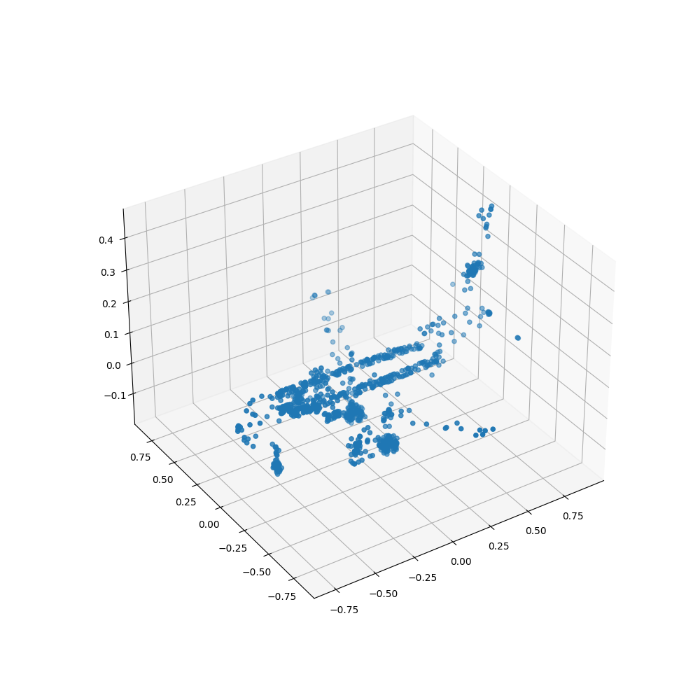

## About
Reimplementation of [**VoteNet** (Qi et al. ICCV 19')](https://arxiv.org/abs/1904.09664) architecture.

3D object detection model for point cloud datatype.

Including implementation of backbone architectures: [**PointNet** (Qi et al. CVPR 17')](https://arxiv.org/abs/1612.00593), [**PointNet++** (Qi et al. NIPS 17')](https://arxiv.org/abs/1706.02413)


Code tests and results
--
### Dataset
```bash
### python dataset/dataset.py
# OUTPUT:
Train dataset size: 9843
Test dataset size: 2468
airplane/test/airplane_0671.off
Class: airplane
Sampled points: 1024
Data samples:
 tensor([[-0.4994,  0.0878,  0.0586],
        [-0.1425, -0.2518, -0.0613],
        [ 0.7644, -0.0099,  0.2678],
        [ 0.1001,  0.1798, -0.1113],
        [-0.4239,  0.0971,  0.0461]])
```
<p align=center></p>

### PointNet
```bash
### python votenet/pointnet.py
# OUTPUT:
Test batch size: 10

Input transform matrix shape: torch.Size([10, 3, 3])
Matrix sample:
tensor([[1., 0., 0.],
        [0., 1., 0.],
        [0., 0., 1.]])

Feature transform matrix shape: torch.Size([10, 64, 64])

Global feature shape: torch.Size([10, 1024])
Class score shape: torch.Size([10, 40])
```